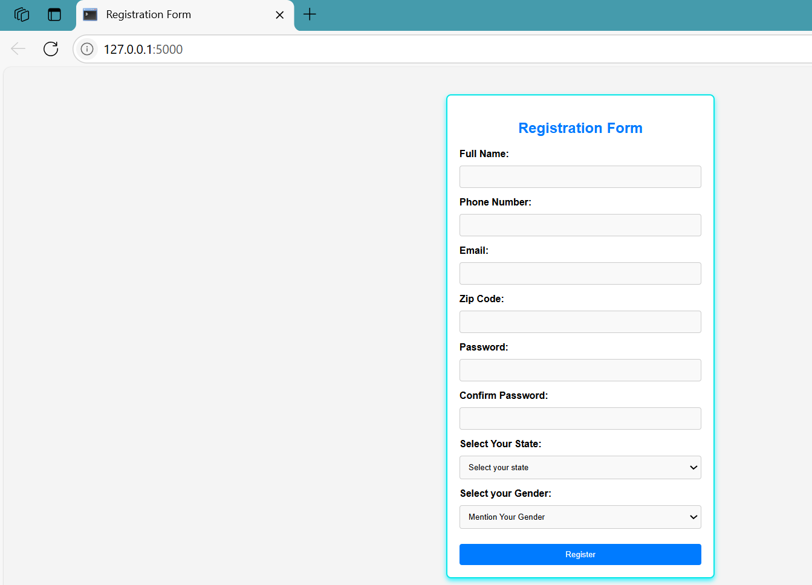
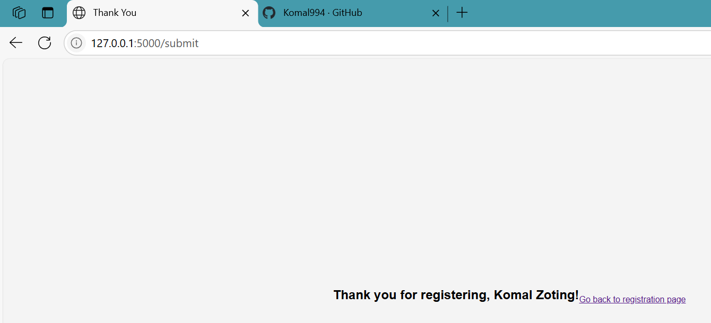
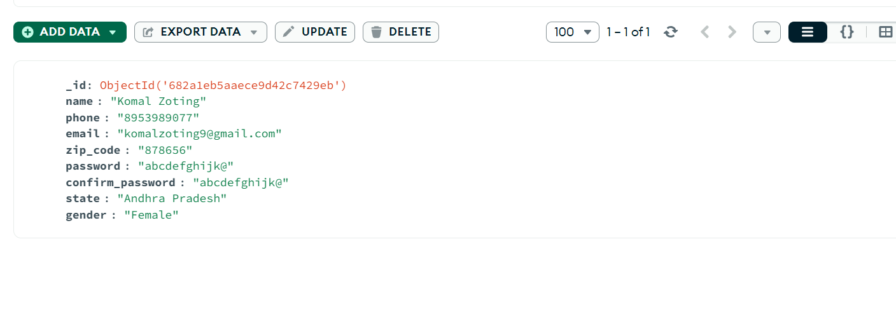

# Registration Form

This project is a web-based **User Registration System** built using **Flask (Python)** for the backend and **MongoDB** for data storage. It includes a responsive HTML form, JavaScript-based validation, and data persistence using a MongoDB collection. Ideal for learning full-stack form handling and Python web development.

## 📌 Table of Contents

- [Overview](#overview)
- [Technologies Used](#technologies-used)
- [Features](#features)
- [Installation and Setup](#installation-and-setup)
- [Project Structure](#project-structure)
- [Form Validations](#form-validations)
- [Screenshots](#screenshots)
- [Future Improvements](#future-improvements)
- [Author](#author)
- [License](#license)
---

## 📖 Overview

The goal of this project is to provide a user-friendly interface for user registration and securely store the collected data in MongoDB. It features:

- Clean and responsive design
- Client-side and server-side validation
- Data persistence with MongoDB
- Thank-you page after successful submission

---

## 🧰 Technologies Used

| Area        | Technology         |
|-------------|--------------------|
| Frontend    | HTML, CSS, JavaScript |
| Backend     | Flask (Python)     |
| Database    | MongoDB (Localhost)|
| Validation  | JavaScript (client), Python (server) |

---

## ✨ Features

- Clean and modern user registration form
- Real-time validation using JavaScript
- Server-side re-validation using Python/Flask
- Stores user data in MongoDB collection
- Shows thank-you message upon successful form submission

---

## 🚀 Installation and Setup

### 1. Clone the Repository

git clone https://github.com/Komal994/Registration-Form.git
cd Registration-Form

### 2. Set Up Python Environment

Make sure Python is installed, then install required libraries:

pip install flask pymongo

### 3. Start MongoDB Server

Ensure MongoDB is running locally:

mongod

### 4. Run the Application

python app.py

Then open your browser and visit:
[http://localhost:5000](http://localhost:5000)

## 🗂️ Project Structure

Registration-Form/
│
├── app.py # Main Flask backend
├── README.md # Project documentation
│
├── templates/ # HTML templates
│ ├── index.html # Registration form
│ └── thankyou.html # Post-submission message
│
├── static/ # Static assets
│ ├── style.css # Form styling
│ └── script.js # JavaScript validation
│
├── screenshots/ # Project screenshots
│ ├── form.png
│ └── thankyou.png

---

## ✅ Form Validations

### Client-Side (JavaScript)

* Validates empty fields
* Proper email format check
* Valid Indian phone number
* 6-digit ZIP code
* Strong password format

### Server-Side (Flask)

* Re-validates all inputs
* Ensures data integrity
* Stores only valid submissions

---

## 🖼️ Screenshots

> 
### Registration Form

### Thank You Page

### Mongodb 

---

## 🔮 Future Improvements

* Encrypt passwords using `bcrypt`
* Add login system
* Use MongoDB Atlas for cloud database
* Add email verification feature

---

## 👩‍💻 Author

* **Name**: Komal Zoting
* **GitHub**: [github.com/Komal994](https://github.com/Komal994)

---

